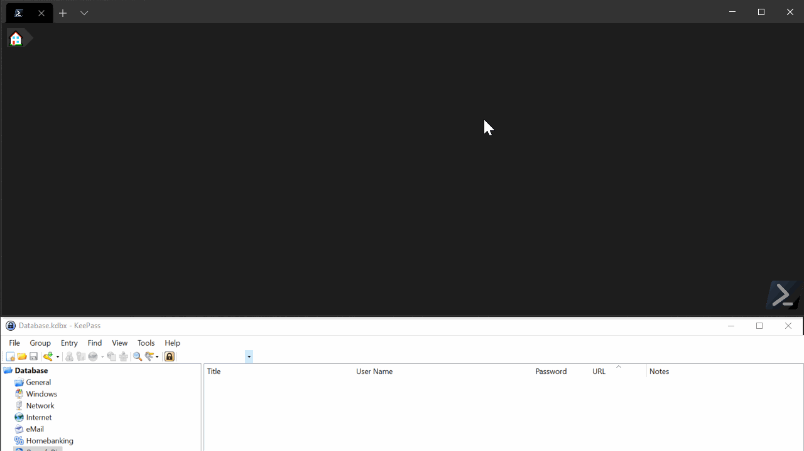

# KeePass Secret Management Extension

## Actions

[![Actions][]][ActionsLink]

## Summary

This is a simple proof-of-concept using a modified version of PoshKeePass to allow for cross platform usage.



## Quick Start

1. Create a keepass database with a master password, Keyfile or both.
1. `Install-Module SecretManagement.KeePass`
1. Run the following command:

    ```powershell
    Register-SecretVault -Name 'testVault' -ModuleName 'SecretManagement.Keepass' -VaultParameters @{
        Path = "path/to/my/vault.kdbx"
        UseMasterPassword = $true
        KeyPath= "path/to/my/keyfile.key"
    }
    ```

1. (optional) Use Test-SecretVault to validate your connection to the vault

    ```powershell
    Test-SecretVault -Vault 'testVault'
    ```

2. Get the secret data using Get-Secret

    ```powershell
    Get-Secret -Name 'My secret entry 1' -VaultName 'testVault'
    ```

## Known Limitations

[Actions]: https://github.com/JustinGrote/SecretManagement.KeePass/workflows/Test/badge.svg?branch=main
[ActionsLink]: https://github.com/JustinGrote/SecretManagement.KeePass/workflows
